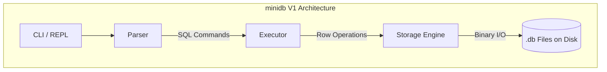
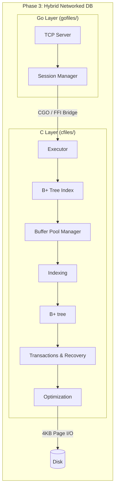

# miniSQL

A relational database built from scratch to understand database internals, storage engines, and buffer pool management. 

Currently, `minidb` features a fully functional C-based SQL CLI, a custom parser, and a persistent flat-file storage engine. 

## Current Architecture (Version 1 - Flat File)
Right now, `minidb` operates entirely locally via a command-line interface.

1. **CLI / REPL (`cli.c`)**: Reads raw SQL strings from standard input.
2. **Parser (`parser.c`)**: Tokenizes the SQL string and extracts the command type (`SELECT`, `INSERT`, `UPDATE`, `DELETE`), columns, values, and `WHERE` clauses into a `table` struct.
3. **Executor (`executor.c`)**: Maps the parsed command to the correct execution function. It handles the logic of matching `WHERE` conditions and formatting output for the terminal.
4. **Storage Engine (`storage.c`)**: Manages permanent disk I/O. 
   - Tables are stored as raw binary files (e.g., `cars.db`).
   - The file begins with a `Header` struct tracking row and column counts.
   - Records are appended sequentially as fixed-size structs.
   - **Deletions** use *tombstones* (a `deleted = 1` flag is set on the record) instead of shrinking the file, allowing fast O(1) in-place updates.

### Supported Features
- **Persistent Storage**: Data survives between runs.
- **Insert**: `insert into cars values audi 23`
- **Select**: `select * from cars` / `select * from cars where age = 24`
- **Update**: `update cars set age = 25 where name = audi`
- **Delete**: `delete from cars where age = 24`

---

## Planned Architecture (Version 2 & 3)

To evolve from a file-writer into a true database, the architecture is designed to grow bottom-up into a hybrid C/Go system.

